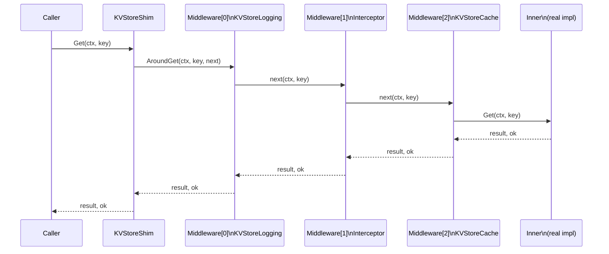

<h1 align=center><pre>shimmy</pre></h1>

The simplest, thinnest Go decorator generator ever.

Shimmy generates composable middleware scaffolding from your Go interface
definitions. Instead of writing identical wrapper boilerplate for each
interface method, you define your logic once and shimmy generates everything
else.

## The Problem

Go's idiomatic answer to cross-cutting concerns (logging, metrics, caching,
retries) is the decorator pattern: a struct that holds an inner
implementation, implements the same interface, and delegates each method
while adding behavior. For an interface with eight methods and three
decorators, that's twenty-four near-identical wrapper functions.

Shimmy eliminates this boilerplate by generating a *shim*: a typed
intermediary that holds your inner implementation and an ordered middleware
chain. You write only the logic that differs.

## Installation

```sh
go install shimmy/cmd/shimmy@latest
```

> **Note:** The module path will change to a public domain (e.g.,
> `github.com/...`) before the first stable release.

## Usage

Point shimmy at a Go source file containing an interface definition:

```sh
shimmy -input path/to/source.go -type MyInterface -output path/to/myinterface_shim_gen.go
```

Or with `go generate`:

```go
//go:generate shimmy -input store.go -type KVStore -output kv_store_shim_gen.go
```

### Flags

| Flag | Description |
|---|---|
| `-input` | Path to the Go source file containing the interface |
| `-type` | Name of the interface to generate from |
| `-output` | Path to write the generated file |

## How It Works

### Code generation

```mermaid
flowchart LR
    iface["Your interface\n(store.go)"]

    subgraph gen["shimmy (code generator)"]
        parse["Parse interface\nAST"]
        generate["Generate shim\nscaffolding"]
    end

    subgraph out["_shim_gen.go (generated)"]
        shim["KVStoreShim\nstruct"]
        mwiface["KVStoreMiddleware\ninterface"]
        base["BaseKVStoreMiddleware\nstruct"]
        call["GetCall / SetCall / ...\nenvelopes"]
        interceptor["NewKVStoreInterceptor\nconstructor"]
    end

    iface --> parse --> generate
    generate --> shim
    generate --> mwiface
    generate --> base
    generate --> call
    generate --> interceptor
```

### Runtime execution

When a method is called on the shim, it passes through each middleware in
slice order before reaching the inner implementation. Any layer can
short-circuit and return early without calling the next layer.



## What Gets Generated

For any interface, shimmy generates five things in a single `_shim_gen.go` file:

**1. A shim struct**: holds the inner implementation and a middleware slice.

**2. A middleware interface**: one typed `Around<Method>` function per interface method.

**3. A base middleware struct**: passthrough implementations of every `Around` method. Embed it and override only what you need.

**4. A Call envelope per method**: a struct carrying all inputs and outputs for a single invocation, implementing the `shimmy.Call` interface. Provides `Method()`, `Args()`, and `Results()` for generic access, plus typed fields for direct access via type assertion.

**5. A `New<Interface>Interceptor` constructor**: wraps a `func(shimmy.Call, func())` as a middleware value, allowing uniform position-controlled behavior anywhere in the chain.

## Example

Given this interface:

```go
// store.go
type KVStore interface {
    Get(ctx context.Context, key string) (string, bool)
    Set(ctx context.Context, key string, value string)
    Delete(ctx context.Context, key string)
}
```

Shimmy generates a `KVStoreShim`, a `KVStoreMiddleware` interface, a
`BaseKVStoreMiddleware` struct, Call envelopes (`GetCall`, `SetCall`,
`DeleteCall`), and `NewKVStoreInterceptor`.

### Writing a middleware

Embed `BaseKVStoreMiddleware` and override only the methods you care about:

```go
type KVStoreLogging struct {
    BaseKVStoreMiddleware
    logger *slog.Logger
}

func (m *KVStoreLogging) AroundGet(
    ctx context.Context, key string,
    next func(context.Context, string) (string, bool),
) (string, bool) {
    m.logger.Info("Get", "key", key)
    result, ok := next(ctx, key)
    m.logger.Info("Get returned", "ok", ok)
    return result, ok
}
```

### Uniform behavior with an interceptor

No per-method boilerplate required:

```go
NewKVStoreInterceptor(func(call shimmy.Call, invoke func()) {
    start := time.Now()
    invoke()
    metrics.RecordLatency(call.Method(), time.Since(start))
})
```

Type-assert into a specific Call envelope when you need typed access:

```go
NewKVStoreInterceptor(func(call shimmy.Call, invoke func()) {
    invoke()
    if c, ok := call.(*GetCall); ok && !c.Result2 {
        log.Warn("cache miss", "key", c.Key)
    }
})
```

### Composing behaviors

```go
shim := &KVStoreShim{
    Inner: &MapStore{},
    Middleware: []KVStoreMiddleware{
        &KVStoreLogging{logger: slog.Default()},
        NewKVStoreInterceptor(func(call shimmy.Call, invoke func()) {
            start := time.Now()
            invoke()
            metrics.RecordLatency(call.Method(), time.Since(start))
        }),
        &KVStoreCache{cache: redisClient},
    },
}
```

Middleware executes in slice order. Each layer controls whether the next layer
is called; any layer can short-circuit and return early.

### More Examples

Head on over to [`examples/`](examples/) to see working examples of shimmy.

## Comparison with Similar Tools

Several other tools generate decorator wrappers for Go interfaces. Here's how
they differ from shimmy:

| | shimmy | [gowrap](https://github.com/hexdigest/gowrap) | [wrapgen](https://github.com/kevinconway/wrapgen) | [go-decorator](https://github.com/dengsgo/go-decorator) |
|---|---|---|---|---|
| Approach | Generates a composable middleware chain | Template-based decorator generation | Template-based (like mockgen) | Single decorator function per struct |
| Composition | Ordered middleware slice, no glue code | Write a new struct combining decorators | Write a new struct combining decorators | Not supported |
| Per-method hooks | Yes, via typed `Around<Method>` | Yes, via template | Yes, via template | No; one function wraps all methods uniformly |
| Uniform cross-cutting | Yes, via `New<Interface>Interceptor` | Partial; template applies uniformly but can't be positioned | Partial; same template limitation | Yes; primary model |
| Early return / short-circuit | Yes, any middleware layer can skip `next` | Yes, via template logic | Yes, via template logic | Yes |
| Type safety | Full; no reflection, type assertions only when opted into | Full | Full | Full |
| Runtime dependency | Minimal (`shimmy.Call` interface only) | None | None | None |
| Templates | None; behavior is plain Go code | Required | Required | None |

**gowrap** is the most mature option and worth evaluating first if you want a
battle-tested tool with a large template library. The template system is
flexible enough to cover most logging and caching use cases.

**wrapgen** is more DIY; it gives you more control over the generated output
at the cost of more template work. A good fit for teams that already have
mockgen in their workflow.

**go-decorator** is the simplest of the three: one decorator function that
uniformly wraps every method. Elegant for pure cross-cutting concerns like
metrics, but awkward when you need method-specific behavior (e.g., caching
only `GetUserProfile`).

**shimmy's** differentiator is the composable middleware chain. Instead of
generating a static, monolithic decorator, it generates an intermediary where
behaviors are separate structs stacked in a slice. Adding, removing, or
reordering behaviors requires no glue code, and interceptor-style middleware
(uniform behavior) sits in the same chain as typed middleware (per-method
behavior), giving you full control over ordering.

## Limitations (v0)

- Embedded interfaces are not supported.
- Generic interfaces are not supported.
- Interfaces with no methods are rejected.

## Design

See [`docs/shimmy-design.md`](docs/shimmy-design.md) for the full design
rationale. The problem statement, the evolution through iterations, and the
principles that shaped the final approach.

## License

This project is licensed under the MIT License.
